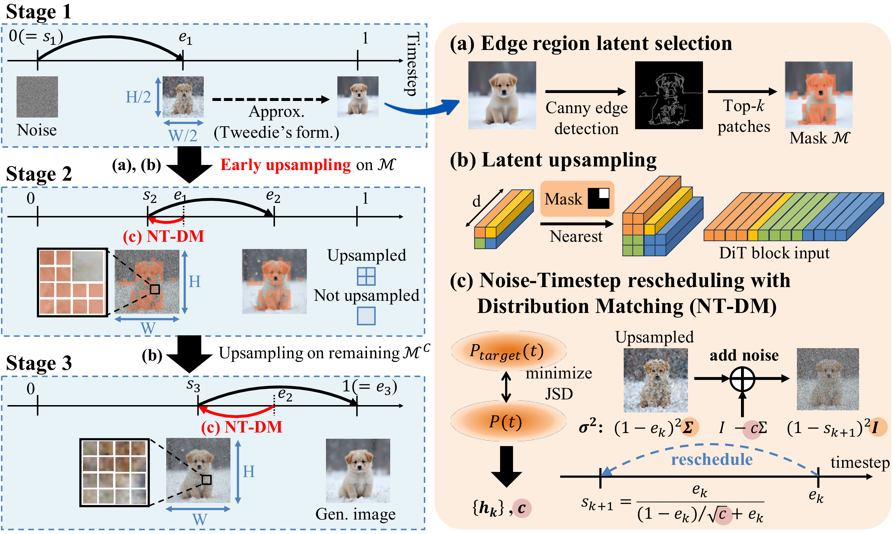

# 🌟 [arXiv] Upsample What Matters: Region-Adaptive Latent Sampling for Accelerated Diffusion Transformers

## 📑 Introduction

> **Upsample What Matters: Region-Adaptive Latent Sampling for Accelerated Diffusion Transformers**
>
> [Wongi Jeong*](https://ignoww.github.io), [Kyungryeol Lee*](https://krlee1.github.io/), [Hoigi Seo](https://seohoiki3215.github.io/), [Se Young Chun](https://icl.snu.ac.kr/) (*co-first)
>
> 📚[arXiv](https://arxiv.org/abs/2507.08422)

This paper proposes **Region-Adaptive Latent Upsampling (RALU)**, a training-free framework for accelerating Diffusion Transformers along the spatial dimension. RALU selectively upsamples only edge-sensitive regions during denoising to suppress artifacts, while preserving the model’s semantic fidelity and visual quality. It further introduces a noise-timestep rescheduling strategy to ensure stable generation across resolution transitions, making it compatible with temporal acceleration methods.



## 🔥 Recent News

   - [2025.08.07] RALU code has been released.
   - [2025.07.11] [RALU](https://arxiv.org/abs/2507.08422) is on arXiv.

## 🚀 Usage

1. **Environment Setup**

   Make sure your environment is capable of running **FLUX**. No adOnly a few additional packages need to be installed2. **Configure Parameters**

   - `use_RALU_default`: Use the predefined configurations (4× or 7× speedup) as described in the RALU paper.
   - `level`: When using `--use_RALU_default`, specify the desired acceleration level (either 4 or 7).
   - `N`: A list of denoising step counts for each of the three stages.
   - `e`: A list of end timesteps for each stage. The last value **must be** `1.0`, as it denotes the final timestep.
   - `up_ratio`:  The ratio of tokens to be early upsampled in **Stage 2**.

4. **Run the Example**

   Execute the RALU_inference.py script.
   
   **Option 1: Using the default RALU setting (4× or 7× speedup)**
   ```bash
   python RALU_inference.py --use_RALU_default --level 4
   ```
   
   **Option 2: Using custom `N` and `e` values**
   ```bash
   python RALU_inference.py --N 4 5 6 --e 0.3 0.45 1.0   # for N=[4, 5, 6], e=[0.3, 0.45, 1.0]
   ```
   > **Note**: The last value of `e` must always be 1.0, indicating the end of the diffusion process.


## 📸 Example Outputs

The images below compare the results of applying 4× and 7× acceleration using naive reduction of `num_inference_steps` in **FLUX.1-dev** vs. using **RALU** with the same speedup factors.


## 🙏 Acknowledgments

This code is based on the `FLUX pipeline` implementation provided by Diffusers. The referenced works are as follows:

- [🤗 Diffusers](https://github.com/huggingface/diffusers)
- [FLUX](https://github.com/black-forest-labs/flux.git)